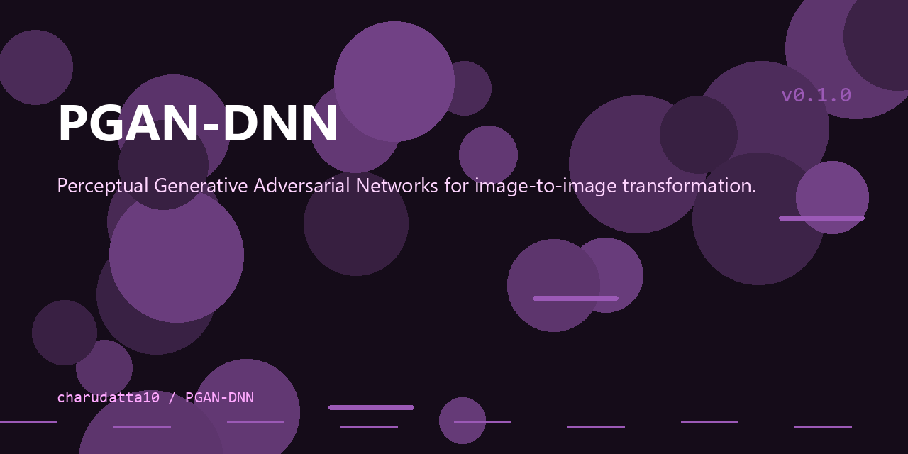

# PGAN-DNN

<p align="center">
  
</p>


Perceptual Generative Adversarial Networks for image-to-image transformation.


## What is this?

This repository contains a Perceptual Generative Adversarial Network (PGAN)
implementation for image-to-image transformations. The PGAN is a generic
framework that learns to map input images to desired output images — for
example a rainy image to its de-rained counterpart, object edges to photos, or
semantic labels to a scene image. The network consists of two feed-forward
convolutional neural networks: an image transformation network T and a
discriminative network D, trained jointly with a perceptual adversarial loss.

## Abstract

In this study, we propose Perceptual Generative Adversarial Networks (PGANs)
for image-to-image transformations. Different from existing application driven
algorithms, PGAN provides a generic framework of learning to map from input
images to desired images, such as a rainy image to its de-rained counterpart,
object edges to photos, and semantic labels to a scenes image. The proposed PAN
consists of two feed-forward convolutional neural networks: the image
transformation network T and the discriminative network D. Besides the
generative adversarial loss widely used in GANs, we propose the perceptual
adversarial loss, which undergoes an adversarial training process between the
image transformation network T and the hidden layers of the discriminative
network D. The hidden layers and the output of the discriminative network D are
upgraded to constantly and automatically discover the discrepancy between the
transformed image and the corresponding ground truth, while the image
transformation network T is trained to minimize the discrepancy explored by the
discriminative network D. Through integrating the generative adversarial loss
and the perceptual adversarial loss, D and T can be trained alternately to
solve image-to-image transformation tasks. Experiments evaluated on several
image-to-image transformation tasks (e.g., image de-raining and image
inpainting) demonstrate the effectiveness of the proposed PAN and its
advantages over many existing works.

## Features

- Generic image-to-image transformation framework
- Perceptual adversarial loss in addition to generative adversarial loss
- Image de-raining and image inpainting experiments

## Install

Requires Python 2 and TensorFlow/Keras:

```sh
pip install numpy tensorflow keras matplotlib
```

## Quickstart

Run the training script:

```sh
python gan_r28_3apr_wed2019.py
```

## Usage

The main entry point is `gan_r28_3apr_wed2019.py`, which defines the PGAN model
(`DCGAN1`) and runs the training loop on the configured dataset.

## License

All rights reserved.